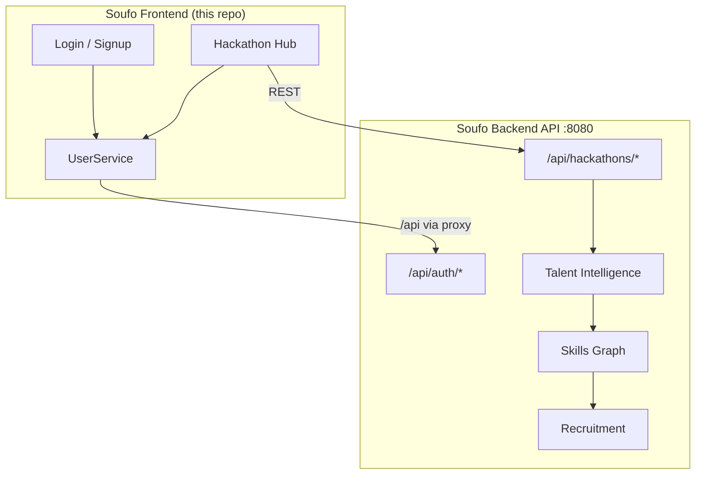

# Soufo

**Inovações em ação** — A unified platform that combines **Hackathon Infrastructure**, **Talent Intelligence**, a **Skills Graph**, and **Recruitment** into one ecosystem for discovering, developing, and hiring technical talent through real-world innovation events.

This repository contains the **Soufo frontend** (`soufo-front`): an Angular 21 single-page application that powers authentication, hackathon management, and the participant experience.

---

## Table of Contents

- [What is Soufo?](#what-is-soufo)
- [How the Platform Works](#how-the-platform-works)
  - [Hackathon Infrastructure](#1-hackathon-infrastructure)
  - [Talent Intelligence Engine](#2-talent-intelligence-engine)
  - [Skills Graph](#3-skills-graph)
  - [Recruitment Platform](#4-recruitment-platform)
- [Architecture Overview](#architecture-overview)
- [Prerequisites](#prerequisites)
- [Getting Started](#getting-started)
  - [Step 1 — Clone the repository](#step-1--clone-the-repository)
  - [Step 2 — Install Node.js and npm](#step-2--install-nodejs-and-npm)
  - [Step 3 — Install project dependencies](#step-3--install-project-dependencies)
  - [Step 4 — Start the backend API (required)](#step-4--start-the-backend-api-required)
  - [Step 5 — Run the development server](#step-5--run-the-development-server)
  - [Step 6 — Open the application](#step-6--open-the-application)
- [Available Scripts](#available-scripts)
- [Tech Stack](#tech-stack)
- [Project Structure](#project-structure)
- [API Integration](#api-integration)
- [Environment & Configuration](#environment--configuration)
- [Testing](#testing)
- [Building for Production](#building-for-production)
- [Troubleshooting](#troubleshooting)
- [License](#license)

---

## What is Soufo?

Soufo is a talent and innovation platform designed to bridge the gap between **hackathons**, **skill development**, and **hiring**. Instead of treating competitions, portfolios, and recruitment as separate workflows, Soufo connects them into a single continuous pipeline:

1. Organizations run hackathons and innovation challenges.
2. Participants build projects, earn recognition, and accumulate verified skill signals.
3. A dynamic Skills Graph maps competencies across people, teams, technologies, and outcomes.
4. Recruiters and companies discover talent based on demonstrated ability—not just résumés.

The frontend in this repo is the primary interface for users to authenticate, browse and register for hackathons, create events, and access their account hub (events, points, projects).

---

## How the Platform Works

Soufo operates as four integrated layers. Each layer feeds data into the next, creating a flywheel from event participation to talent discovery.

### 1. Hackathon Infrastructure

The operational backbone for innovation events.

| Capability | Description |
|---|---|
| **Event creation** | Organizers configure hackathons with title, company, location, schedule, sponsors, and contact details. |
| **Registration & teams** | Participants sign up with their account and are assigned to teams for collaboration. |
| **Event lifecycle** | Events move through statuses (draft, open, in progress, completed) with centralized listing and management. |
| **Central hub** | The Home dashboard (`/home`) is the **Centro de Hackathons Soufo**—the single place to create and follow competitions. |

**In this repo:** The Home page implements hackathon listing, creation (`POST /api/hackathons`), and registration (`POST /api/hackathons/:id/register`).

### 2. Talent Intelligence Engine

An analytics layer that turns participation into actionable talent insights.

| Capability | Description |
|---|---|
| **Behavioral signals** | Tracks engagement across events, projects, submissions, and team collaboration. |
| **Performance scoring** | Evaluates outcomes from hackathons (delivery, innovation, technical depth). |
| **Profile enrichment** | Builds a living talent profile from real activity instead of self-reported skills alone. |
| **Matching** | Surfaces candidates whose demonstrated work aligns with company needs and role requirements. |

**Platform role:** As users participate in more hackathons and ship more projects, the engine accumulates evidence of how they work—not just what they claim on a CV.

### 3. Skills Graph

A connected graph model linking people, skills, technologies, projects, and events.

```
[Participant] ──demonstrates──▶ [Skill: React]
       │                              │
   joins event                  used in
       │                              │
       ▼                              ▼
[Hackathon] ◀──organizes── [Company] ──▶ [Project]
```

| Node type | Examples |
|---|---|
| **People** | Developers, designers, mentors, judges |
| **Skills** | TypeScript, UX, cloud architecture, leadership |
| **Artifacts** | Repositories, demos, submissions |
| **Events** | Hackathons, workshops, challenges |
| **Organizations** | Sponsors, employers, communities |

**Platform role:** The Skills Graph is the semantic layer that powers search, recommendations, and recruitment matching. Every hackathon registration and project submission adds edges to the graph.

### 4. Recruitment Platform

The hiring interface built on verified talent data.

| Capability | Description |
|---|---|
| **Talent discovery** | Search and filter candidates by skills proven in hackathons and projects. |
| **Evidence-based profiles** | View portfolios, event history, team contributions, and skill graph connections. |
| **Employer workflows** | Companies sponsor events, scout participants, and pipeline candidates into roles. |
| **Points & gamification** | Reward systems (visible in the user menu) incentivize participation and skill growth. |

**Platform role:** Recruitment is not a separate product—it is the natural output of the hackathon and skills ecosystem. Companies that run or sponsor events gain first access to top performers.

---

## Architecture Overview



| Layer | Technology |
|---|---|
| Frontend | Angular 21, TypeScript 5.9, Tailwind CSS 3, Reactive Forms, Signals |
| API proxy | `proxy.conf.json` → `http://localhost:8080` |
| Backend | Separate service (Spring Boot or equivalent) on port **8080** |
| Auth | JWT token stored in `localStorage` (`soufo-auth-token`) |

---

## Prerequisites

Before you begin, ensure the following are installed on your machine:

| Tool | Minimum version | Recommended | Verify with |
|---|---|---|---|
| **Node.js** | 20.x | 22.x LTS | `node -v` |
| **npm** | 10.x | 11.x (project uses `npm@11.13.0`) | `npm -v` |
| **Git** | 2.x | Latest | `git --version` |

Optional but recommended:

- **Angular CLI** — installed locally via `npm`; no global install required.
- **Soufo backend** — required for login, registration, and hackathon APIs.

---

## Getting Started

Follow these steps from a clean machine to run the Soufo frontend locally.

### Step 1 — Clone the repository

**Option A — SSH (recommended if you have GitHub SSH keys configured):**

```bash
git clone git@github.com:tiagofoks/soufo_front.git
cd soufo_front
```

**Option B — HTTPS:**

```bash
git clone https://github.com/tiagofoks/soufo_front.git
cd soufo_front
```

### Step 2 — Install Node.js and npm

If Node.js is not installed:

1. Download the LTS installer from [https://nodejs.org](https://nodejs.org).
2. Run the installer and follow the prompts (npm is included).
3. Restart your terminal and verify:

```bash
node -v    # e.g. v22.14.0
npm -v     # e.g. 11.13.0
```

> This project declares `"packageManager": "npm@11.13.0"` in `package.json`. Using npm 11 avoids lockfile inconsistencies.

### Step 3 — Install project dependencies

From the project root (`soufo_front/`):

```bash
npm install
```

This installs all runtime and development dependencies listed in `package.json`, including:

| Category | Packages |
|---|---|
| **Angular core** | `@angular/core`, `@angular/common`, `@angular/router`, `@angular/forms`, … |
| **Build tooling** | `@angular/cli`, `@angular/build`, `typescript` |
| **Styling** | `tailwindcss`, `postcss`, `autoprefixer` |
| **Testing** | `vitest`, `jsdom` |
| **Utilities** | `rxjs`, `tslib`, `prettier` |

Installation typically takes 1–3 minutes depending on your network speed. A `node_modules/` folder and an up-to-date `package-lock.json` will be created.

### Step 4 — Start the backend API (required)

The frontend expects a REST API at **`http://localhost:8080`**.

Start your Soufo backend service before using login, signup, or hackathon features. Without it, API calls will fail with network errors.

The dev server proxies `/api/*` requests to the backend automatically (see [Environment & Configuration](#environment--configuration)).

### Step 5 — Run the development server

```bash
npm start
```

This runs `ng serve --proxy-config proxy.conf.json`, which:

- Compiles the Angular app in development mode
- Serves it at **http://localhost:4200**
- Proxies `/api` requests to `http://localhost:8080`
- Enables hot reload on file changes

You should see output similar to:

```
Application bundle generation complete.
Watch mode enabled. Watching for file changes...
➜  Local:   http://localhost:4200/
```

### Step 6 — Open the application

1. Open your browser and go to [http://localhost:4200](http://localhost:4200).
2. You will be redirected to the **Login** page (`/login`).
3. Create an account via **Criar conta** (`/signup`) or log in with existing credentials.
4. After authentication, access the **Centro de Hackathons Soufo** at `/home`.

---

## Available Scripts

| Command | Description |
|---|---|
| `npm start` | Start dev server with API proxy on port 4200 |
| `npm run build` | Production build → `dist/` |
| `npm run watch` | Development build with file watching |
| `npm test` | Run unit tests with Vitest |
| `npm run ng -- <command>` | Run Angular CLI commands (e.g. `ng generate component`) |

---

## Tech Stack

| Layer | Technology |
|---|---|
| Framework | [Angular 21](https://angular.dev) (standalone components, signals) |
| Language | TypeScript 5.9 (strict mode) |
| Styling | [Tailwind CSS 3.4](https://tailwindcss.com) |
| Forms | Angular Reactive Forms |
| HTTP | Fetch API + dev proxy |
| Testing | [Vitest](https://vitest.dev) |
| Formatting | Prettier |

---

## Project Structure

```
soufo_front/
├── src/
│   ├── app/
│   │   ├── pages/
│   │   │   ├── login/           # Authentication
│   │   │   ├── signup/          # User registration
│   │   │   ├── forgot-password/ # Password recovery
│   │   │   └── home/            # Hackathon hub (Centro de Hackathons)
│   │   ├── services/
│   │   │   └── user.ts          # Auth & user session (JWT, localStorage)
│   │   ├── app.routes.ts        # Route definitions
│   │   ├── app.config.ts        # App providers
│   │   └── app.ts               # Root component
│   ├── assets/                  # Images (logo, selo)
│   ├── index.html
│   ├── main.ts
│   └── styles.css               # Global styles + Tailwind
├── proxy.conf.json              # Dev API proxy → localhost:8080
├── angular.json                 # Angular workspace config
├── tailwind.config.js
├── postcss.config.js
├── tsconfig.json
└── package.json
```

### Routes

| Path | Component | Purpose |
|---|---|---|
| `/` | Redirect → `/login` | Entry point |
| `/login` | LoginComponent | Sign in |
| `/signup` | SignupComponent | Create account |
| `/forgot-password` | ForgotPasswordComponent | Password recovery |
| `/home` | HomeComponent | Hackathon dashboard |

---

## API Integration

During development, the Angular dev server proxies API calls:

| Frontend path | Proxied to |
|---|---|
| `/api/*` | `http://localhost:8080/api/*` |

### Key endpoints used by this frontend

| Method | Endpoint | Used by |
|---|---|---|
| `POST` | `/api/auth/login` | Login |
| `POST` | `/api/auth/register` | Signup |
| `GET` | `/api/hackathons` | List hackathons |
| `POST` | `/api/hackathons` | Create hackathon |
| `POST` | `/api/hackathons/:id/register` | Register for event |

Authentication tokens are stored in `localStorage` under `soufo-auth-token`.

---

## Environment & Configuration

| File | Purpose |
|---|---|
| `proxy.conf.json` | Maps `/api` → backend during `npm start` |
| `angular.json` | Build, serve, and test configuration |
| `tailwind.config.js` | Tailwind content paths and theme |
| `.prettierrc` | Code formatting rules |

To point the proxy at a different backend URL, edit `proxy.conf.json`:

```json
{
  "/api": {
    "target": "http://localhost:8080",
    "secure": false,
    "changeOrigin": true
  }
}
```

---

## Testing

Run the unit test suite:

```bash
npm test
```

Tests use Vitest with jsdom. Spec files live alongside components (e.g. `home.spec.ts`, `user.spec.ts`).

---

## Building for Production

```bash
npm run build
```

Output is written to `dist/`. Serve the built files with any static host (Nginx, Vercel, Netlify, etc.) and configure your production API base URL accordingly.

---

## Troubleshooting

| Problem | Solution |
|---|---|
| `npm install` fails | Ensure Node.js ≥ 20. Delete `node_modules/` and `package-lock.json`, then run `npm install` again. |
| Login/signup does not work | Confirm the backend is running on port **8080**. |
| Hackathon list is empty | Normal if no events exist—use **Cadastrar Novo Evento** to create one. |
| CORS or network errors on `/api` | Use `npm start` (not plain `ng serve`) so the proxy is active. |
| Port 4200 already in use | Run `ng serve --port 4300` or stop the process using port 4200. |

---

## License

This project is private (`"private": true` in `package.json`). Contact the Soufo team for licensing and contribution guidelines.

---

<p align="center">
  <strong>Soufo</strong> — Hackathon Infrastructure · Talent Intelligence · Skills Graph · Recruitment
  <br>
  <em>Inovações que transformam ideias em ação</em>
</p>
